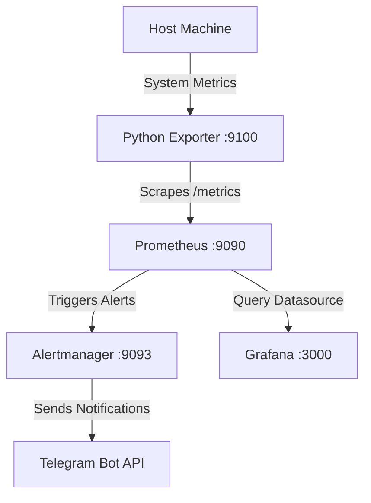

# 
```text
 __      __  ___  _____  ___  _  _  _____  ___   __      __ ___  ___
 \ \    / / / _ \|_   _|/ __|| || ||_   _|/ _ \  \ \    / /| __|| _ \
  \ \/\/ / | |_| | | | | (__ | __ |  | | | |_| |  \ \/\/ / | _| |   /
   \_/\_/   \_/ \_||_|  \___||_||_|  |_|  \_/ \_/   \_/\_/  |___||_|_|
```

WatchTower is a complete, self-contained Infrastructure Monitoring & Alerting System built using Prometheus, Grafana, Alertmanager, and a custom Python metrics exporter.

## Tech Stack Badges


---

## Architecture Diagram



---

## Setup & Installation

### Prerequisites
- Docker & Docker Compose installed on the host system.

### Quick Start
1. **Prepare Environment Settings**:
   Copy `.env.example` to `.env` and fill in your custom Telegram bot details (pre-configured with the default requested credentials).
   ```bash
   cp .env.example .env
   ```

2. **Start the Stack**:
   Deploy all containers in detached mode:
   ```bash
   docker compose up -d
   ```

3. **Verify running containers**:
   ```bash
   docker compose ps
   ```

---

## Endpoints Summary

| Service | Port | Endpoint | Description |
|---|---|---|---|
| **Flask Exporter** | `9100` | `http://localhost:9100/metrics` | Exposes system resource metrics |
| **Prometheus** | `9090` | `http://localhost:9090` | Time-series DB and alerting engine |
| **Alertmanager** | `9093` | `http://localhost:9093` | Alert routing & Telegram integration |
| **Grafana** | `3000` | `http://localhost:3000` | Visual dashboards |

> **Grafana Credentials**:
> - **Username**: `admin`
> - **Password**: `watchtower`

---

## Grafana Dashboard

The dashboard is auto-provisioned at startup and includes 5 real-time panels:
1. **CPU Usage** (Gauge)
2. **Memory Usage** (Gauge)
3. **Disk Usage** (Gauge)
4. **Network In/Out** (Timeseries graph showing RX/TX transfer rate)
5. **Alerts History** (Table showing active/firing alerts)

*(Insert Grafana Dashboard Screenshot Here)*

---

## Triggering Test Alerts

You can verify that the alerting pipeline and Telegram notifications are working using two methods:

### Method A: Mock Alert via API (Quickest)
Directly post a test alert to Alertmanager's REST API. This will instantly trigger a Telegram notification.

**Bash (Linux/Mac/WSL)**:
```bash
curl -H "Content-Type: application/json" \
  -d '[{"labels":{"alertname":"HighCPU","severity":"warning"},"annotations":{"description":"CPU usage is 85%, which is above the 80% threshold."}}]' \
  http://localhost:9093/api/v1/alerts
```

**PowerShell (Windows)**:
```powershell
Invoke-RestMethod -Method Post -Uri "http://localhost:9093/api/v1/alerts" -ContentType "application/json" -Body '[{"labels":{"alertname":"HighCPU","severity":"warning"},"annotations":{"description":"CPU usage is 85%, which is above the 80% threshold."}}]'
```

---

### Method B: Real Resource Stressing
Run a Python script to temporarily consume CPU resources above the `80%` threshold for more than 1 minute.

```python
# stress_cpu.py
import time
import multiprocessing

def stress():
    while True:
        pass # Continuous calculation

if __name__ == '__main__':
    print("Stressing CPU for 90 seconds...")
    processes = [multiprocessing.Process(target=stress) for _ in range(multiprocessing.cpu_count())]
    for p in processes:
        p.start()
    time.sleep(90)
    for p in processes:
        p.terminate()
    print("Stress test completed.")
```
Once the threshold is exceeded for 1 minute, Prometheus will transition the `HighCPU` alert status from `PENDING` to `FIRING` and dispatch the notification.